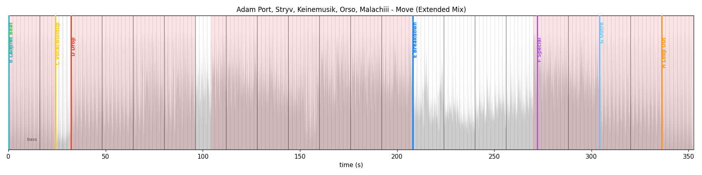

# autohotcue

**Automatic hot cues for [djay Pro](https://www.algoriddim.com/djay-pro-mac), written straight into djay's own library.**

autohotcue analyzes a track's audio, places an 8-pad hot-cue layout on musically
meaningful boundaries, and writes the cues directly into djay's `MediaLibrary.db`.
No USB export, no intermediate app, no reliance on another DJ tool's phrase data —
and it works on **`.opus`/`.ogg`**, which rekordbox, Serato, and the
rekordbox→djay bridges refuse.



---

## Why it exists

djay Pro has no automatic hot-cue feature, and every off-the-shelf alternative
(Lexicon, Mixed In Key → rekordbox → djay) either skips djay entirely or can't read
`.opus`/`.ogg`. autohotcue closes both gaps by speaking djay's database format
directly and analyzing the audio itself — so the format a track happens to be in
never matters, and the cues land in the app you actually mix in.

It's a single pure-Python package with one external runtime dependency (`ffmpeg`).
No service, no daemon, no cloud.

---

## How it works

A track flows through five stages — decode, beat-track, grid-lock, place cues, write:

1. **Decode** to PCM with `ffmpeg` (any format it can read: opus, ogg, flac, m4a, …).
2. **Beat & downbeat tracking** with [beat_this](https://github.com/CPJKU/beat_this)
   (ISMIR 2024), on Apple-Silicon GPU (MPS) when available. This is the analysis bottleneck.
3. **Grid-lock** (`gridlock.py`): fit one straight beat grid to the tracked
   beats/downbeats so every cue sits exactly on djay's rendered lattice. Spliced or
   ambiguous grids degrade gracefully — cues are still placed, phrase-snapping just
   turns off.
4. **Place cues** with the selected [engine](#engines). The default **`ml-bass`**
   detects kick-band (30–150 Hz) bass-in / bass-out / bass-return events and snaps
   them to the 8-bar phrase grid — Afro-House-native structure with no separate
   segmentation step.
5. **Write** the cues into djay's `mediaItemUserData` record as `ADCCuePoint`
   objects, serialized in djay's own undocumented **[TSAF](#the-tsaf-format)** binary
   format — re-checked byte-for-byte before anything touches the database.

`propose`, `viz`, and `verify` are read-only; only `apply` writes.

### The cue layout

The `ml-bass` engine places this 8-pad layout (cue letters mirror the djcues convention):

| Pad | Cue        | Placed at |
|-----|------------|-----------|
| A   | First Beat | first bar at full level |
| B   | Loop In    | = A |
| C   | Buildup    | the pre-drop bass-out (build / vocal) |
| D   | Drop       | the payoff bass-in — a return, or ≥20% into the track (never the groove start) |
| E   | Breakdown  | first ≥8-bar bass-out after the drop |
| F   | 2nd Drop   | first ≥8-bar bass-return after the breakdown |
| G   | Outro      | start of the final mix-out (≥16 audible bars remain) |
| H   | Loop Out   | last fully-audible 8-bar loop boundary |

The structure engines (below) instead map detected song-form segments onto the same
pads via a pure placement policy (`cuepolicy.py`).

---

## Engines

Pick with `--engine` (default `ml-bass`). All but `legacy` use beat_this for the grid;
they differ only in how they decide *where the cues go*.

| `--engine`        | Structure method | Notes |
|-------------------|------------------|-------|
| **`ml-bass`** (default) | kick-band bass events + 8-bar phrase snapping | Afro-House-native; no segmentation; pure numpy/scipy |
| `ml` / `ml-librosa` | librosa Laplacian segmentation | song-form segments → cue policy |
| `ml-allin1`       | [all-in-one-mlx](https://github.com/mir-aidj/all-in-one) | Apple-Silicon GPU; `uv sync --extra allin1` · `docs/allin1-backend.md` |
| `ml-songformer`   | [SongFormer](https://github.com/MOSS-Music/SongFormer) | CPU by default; `uv sync --extra songformer` · `docs/songformer-backend.md` |
| `legacy`          | band-energy heuristics | pre-overhaul behavior, kept for comparison |

djay's stored BPM is only ever **cross-checked** against the tracked tempo — it never
drives placement. `--nudge-beats N` shifts the fitted grid by N beats for the rare
track whose downbeat phase is audibly off.

---

## Install

Requires **Python 3.11+** (pinned to 3.13.3 via `.python-version`),
[uv](https://docs.astral.sh/uv/), and **`ffmpeg`** on `PATH`.

```bash
brew install ffmpeg          # or your platform's package manager
uv sync                      # create the venv + install deps
```

The first analysis run downloads beat_this model checkpoints once (network needed).
Optional structure engines are extras: `uv sync --extra allin1` and/or
`uv sync --extra songformer`.

---

## Usage

```bash
# Analyze and print the proposed cues — read-only, djay not needed.
uv run autohotcue propose "/path/to/track.opus"

# Other engines
uv run autohotcue propose "/path/to/track.opus" --engine ml          # librosa structure
uv run autohotcue propose "/path/to/track.opus" --engine ml-allin1   # needs --extra allin1
uv run autohotcue propose "/path/to/track.opus" --engine legacy

# Render a waveform + segment/bass spans + downbeat ticks + cue map to PNG
uv run autohotcue viz "/path/to/track.opus" cuemap.png

# Write the cues into djay's library  (QUIT djay first)
uv run autohotcue apply "/path/to/track.opus"

# Read back what djay currently has stored for a track
uv run autohotcue verify "/path/to/track.opus"

# Score engines against hand-labeled ground truth
uv run autohotcue bench truth.json --engines ml-bass,ml,legacy -j 4
```

The track must already be in djay's **My Collection** so the library has a record to
attach cues to. Tracks that already have cues need `--force` to overwrite.

### Folders & parallelism

Point `propose` / `apply` / `verify` at a **directory** to process every audio file
under it recursively. A folder `apply` takes **one** backup for the whole run and
reports per-track skips/failures with a summary instead of aborting on the first
problem track.

```bash
uv run autohotcue apply "/path/to/Afro House/"          # default: decode-ahead pipeline
uv run autohotcue apply "/path/to/Afro House/" -j 4     # 4 CPU worker processes
```

Two execution modes for a folder run:

- **`-j 1` (default) — decode-ahead pipeline.** Background threads decode the next
  tracks and run the CPU DSP stage (grid-fit + cue placement) *while* the single GPU
  (MPS) beat_this context runs inference back-to-back. One model, one GPU context, no
  stacking. Tunable with `--decode-threads N` (default 2) and `--dsp-threads N`
  (default 1; `0` runs DSP inline). `--no-pipeline` forces strict sequential analysis.
- **`-j >1` — process pool.** `-j N` analyzes N tracks in parallel worker processes
  (`-j 0` = one per CPU core). Workers run on **CPU only**; MPS is used only at `-j 1`.

In every mode **database writes stay serialized on the main thread** — only the audio
analysis is parallelized.

> **Which `-j` should I use? On Apple Silicon, keep the default `-j 1` — it's the
> fastest *and* the most memory-safe.** `-j` is not "more workers = faster" here:
> beat_this (the bottleneck) only runs on the **GPU (MPS) at `-j 1`**. Any `-j >1`
> (including `-j 0`) drops every worker to **CPU** inference *and* loads a separate copy
> of the model per worker. So fanning out trades one fast GPU stream for many slower CPU
> streams, and `-j 0` (one worker per core) can load ~N model copies at once — enough to
> push a 32 GB machine into swap. The decode-ahead + DSP-offload pipeline exists precisely
> so the single `-j 1` MPS stream runs flat-out (decode + DSP hide *under* inference).
> Reach for `-j N` only on a machine with no usable GPU, where CPU fan-out is the only
> parallelism available.

### Performance

Overlapping decode and DSP with GPU inference makes a folder run roughly inference-bound.
On an M2 Max (MPS), representative ~6-minute Afro House `.opus`, warm cache:

| Folder run (`-j 1`)        | throughput        |
|----------------------------|-------------------|
| sequential (`--no-pipeline`) | ~19–20 tracks/min |
| decode-ahead only          | ~25–26 tracks/min |
| **+ DSP offload (default)** | **~29–30 tracks/min** |

≈1.5× over sequential, with byte-identical cues — overlap only changes *when* work runs,
never the result.

### Bench ground truth

Hand-label tracks in JSON (partial slots are fine):

```json
{
  "tracks": [
    {"path": "/path/to/track.opus", "cues": {"A": 0.512, "D": 92.31, "G": 180.0}}
  ]
}
```

`bench` reports per-slot hit-rate (±1 beat, ±1 bar), MAE, and runtime per engine, using
one BPM yardstick (djay's BPM when `--library` is given, else the tracked tempo).

---

## Safety

autohotcue writes into a real, irreplaceable music library, so the write path is
deliberately conservative:

- **djay must be quit.** `apply` refuses if djay Pro is running and **re-checks
  immediately before the write**, in case djay launched during the (slow) analysis.
- **Exact track matching.** Tracks are matched by their full `file://` source URL.
  Phantom duplicates (a leftover location record with no other metadata) lose to the
  real catalog entry; a genuinely ambiguous match is refused, never guessed — so cues
  never land on the wrong track.
- **Faithful-edit guard.** Before modifying a record, its original blob must
  re-serialize byte-for-byte; if autohotcue can't reproduce it exactly, it refuses,
  so it can never corrupt the record's other fields.
- **Self-checking writes.** Every blob autohotcue writes is re-parsed and
  re-serialized and must match before it touches the database.
- **Unique, timestamped backups.** Each `apply` run checkpoints the WAL and copies
  `MediaLibrary.db` (+ `-wal`/`-shm`) into a fresh dir under
  `~/Music/djay/Backups/autohotcue/` before its first write (one backup per folder
  batch), never overwriting an earlier backup.
- **Overwrite protection.** Tracks with existing cues require `--force`.

> **iCloud caveat.** djay syncs its library to iCloud through its own code path. A
> direct DB write sets `userChangedCloudKeys` but bypasses that machinery, so
> externally-written cues may not propagate to other devices and could, in principle,
> be overwritten by a later iCloud pull. Treat **single-machine** (or djay's iCloud
> library sync off) as the supported case.

---

## The TSAF format

djay stores per-track metadata as binary blobs in a YapDatabase-on-SQLite file, using
an undocumented object-archive format (magic `TSAF`). `src/autohotcue/tsaf.py` is a
from-scratch parser **and** serializer for it, reverse-engineered and validated by
reproducing **every blob in a real djay library byte-for-byte**.

That byte-exact round-trip — `serialize(parse(blob)) == blob` for every blob — is the
single property that makes writing to the live database safe, and the test suite
enforces it on the whole library. `tsaf.py` is kept a generic codec with no
project-specific logic.

---

## Project layout

```
src/autohotcue/
    tsaf.py       # TSAF binary parser + serializer (byte-exact round-trip)
    djaydb.py     # MediaLibrary.db reader/writer, backups, cue-record builder
    backends.py   # beat_this + librosa / allin1 / songformer structure backends
    _allin1.py    # optional all-in-one-mlx structure (ml-allin1)
    _songformer.py # optional SongFormer structure (ml-songformer)
    gridlock.py   # straight beat-grid fit + cue snapping to djay's lattice
    bassline.py   # ml-bass: kick-band bass events + 8-bar phrase snapping (default)
    cuepolicy.py  # pure structure-based cue-placement policy
    analysis.py   # decode + analyze() dispatcher (infer_beats / cues_from_beats split)
    pipeline.py   # decode-ahead + DSP-offload folder pipeline
    bench.py      # ground-truth eval harness (hit-rate, MAE, runtime)
    viz.py        # waveform + segment/bass spans + downbeat ticks + cue-map PNG
    cli.py        # propose / viz / apply / verify / bench
tests/            # incl. test_tsaf (full-library round-trip), test_e2e (real tracks),
                  # test_pipeline, test_gridlock, test_bassline, test_cuepolicy, …
docs/             # backend notes, specs, roadmap
```

---

## Development

```bash
uv sync
uv run pytest                       # full suite
uv run pytest -q -k roundtrip       # the load-bearing TSAF round-trip
```

The headline test parses **and** re-serializes every blob in the local djay library
and asserts byte-for-byte equality; it **skips automatically** when no djay library is
present (e.g. CI), while the synthetic tests still run. `test_e2e.py` runs against real
tracks when they exist on the machine.

There is no build/deploy step — it's a local CLI (`uv build` produces a wheel if you
want one). No formatter/linter is configured; match the surrounding style.

> **Note on automation.** djay Pro is a Catalyst (iOS-on-Mac) app whose library UI
> rejects synthetic accessibility/keystroke input, so end-to-end GUI automation of
> "load a track and screenshot its cues" isn't reliable. Writes are verified at the DB
> level instead (`verify` / the round-trip test).

---

## License

MIT.
